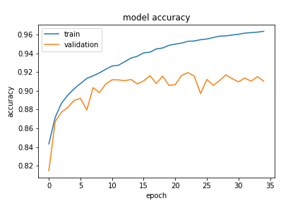
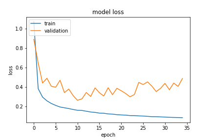

# Unet-Paper-Implementation

In this project, we provide an implementation for the research paper **U-Net: Convolutional Networks for Biomedical Image Segmentation** by (Olaf Ronneberger, Philipp Fischer, and Thomas Brox). 

Please use `Google Colab` to run this code. Run the Unet_implementation_final.ipynb

## Table of contents

- Import all the required libraries

- Define the directories

- Data Preprocessing:
  - Normal Augmentation
  - Overlap Tile Strategy
  - Gaussian Elastic Transformation
  - Label Cropping to dimension (388,388)
  
- Import training and validation data

- Unet Model Architecture

- Train the model

- Plots

## Downloading the dataset
Please download these in different folders:
Images of Original Dataset can be found at the link - https://drive.google.com/drive/folders/1NMFq87ftuRZ-xQJs8HbuiVwIDdZNBetu?usp=sharing

Labels of Original Dataset can be found at the link - https://drive.google.com/drive/folders/1NKZpXN49HgWWopM5MOzE48EG3L0jVJFI?usp=sharing

Final images of preprocessed and augmented train data can be downloaded from link - https://drive.google.com/drive/folders/1dbDVH9y_r5jET9o1ibDwaOok9ga7pXj1?usp=sharing

Final labels of preprocessed and augmented train data can be downloaded from link - https://drive.google.com/drive/folders/16OFOSRc0WC7XyI5VPOn26fOxdCzNuyCK?usp=sharing

Final images of preprocessed and augmented validation data can be downloaded from link - https://drive.google.com/drive/folders/1Wps_M_xOg-bqCsxGqEY3ZXmdhKfR_Ccu?usp=sharing

Final labels of preprocessed and augmented validation data can be downloaded from link - https://drive.google.com/drive/folders/1-4kN4P8VOI49qKzGS4j7WXFGrXkx_fwA?usp=sharing

Directory containing all images and labels generated at each step of preprocessing - https://drive.google.com/drive/folders/1-5NWKZWIUfP8oz9IRa5FSZS01KfDwYPA?usp=sharing

## Defining directories
Please **create** and **mention** the directory path for saving images and labels at each step of augmentation. The images and labels generated at each step of preprocessing is saved and utilized for the next step. The comment corresponding to each variable defines the purpose of directory and mention accordingly.

## Preprocessing Data
You can preprocess the data by running the Preprocessing Data section of the .ipynb notebook and other sections before it.

## Training and validation
After preprocessing is done and we can perform training. The sections used are Importing training and validation data, Unet Model Architecture, The Training part.
Please change variables in the Defining Directories section which contain the final preprocessed training and validation data according to your directory. The variables are:

elas_data_dir - Directory path for storing the results of elastic deformation of train images of data

final_train_label_dir - Directory path for storing the final train labels of data

over_val_data_dir - Directory path for storing the results of cropping of validation images of data for overlap tile stratgy

final_val_label_dir -Directory path for storing the final validation labels  of data

In The Training part section please change the variables
log_dir - Enter directory path for saving logs

model_name - Enter full filename path for saving model

Our trained model can be downloaded from the link - https://drive.google.com/file/d/12C1Q-DRAr0SzOj48U235vWpbjKJaadb6/view?usp=sharing

## Plots: 

## Contributors:
- Saumil Agarwal (2018A7PS0268P) 
- Atharva Anand Joshi (2018A3PS0515P) 
- Aayush Singhal (2018A1PS0047P) 

